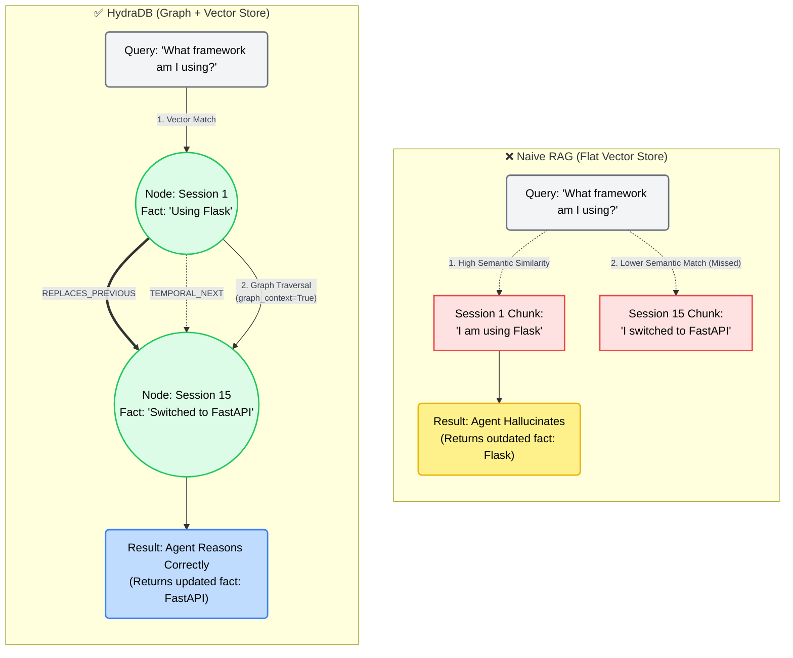

# Why HydraDB Matters: Graph vs Flat Vector Search

This document illustrates exactly why a standard RAG pipeline fails on long-term memory tasks (like the BEAM benchmark) and how HydraDB's Graph + Vector architecture solves it through relational continuity.

### Key Concepts Highlighted

1. **The Semantic Trap**: In naive RAG, "I am using Flask" often has a higher cosine similarity to the question "What framework am I using?" than the update statement ("switched to FastAPI"). The retriever blindly pulls the old fact.
2. **Relational Continuity**: HydraDB doesn't just store isolated text chunks. It links them as nodes in a graph. When the vector engine hits Session 1, the graph traversal engine automatically follows the `TEMPORAL_NEXT` or `REPLACES_PREVIOUS` edges to pull the subsequent context from Session 15.
3. **Reasoning-Ready Payload**: Because HydraDB returns the *connected timeline* of facts, our category-aware LLM prompt can successfully apply `Knowledge Update` logic to output the correct, latest fact.
