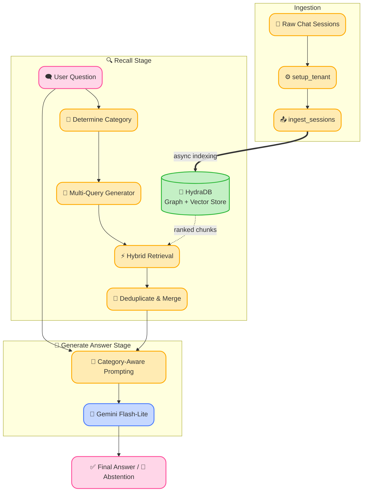

<div align="center">
  <h1>🧠 HydraGraph Memory</h1>
  <p><b>Track 03 — Memory and Context Retrieval</b></p>
  <p>A graph-native agent memory layer built on <a href="https://hydradb.com">HydraDB</a> that handles cross-session continuity across 30–40 sessions with accurate fact synthesis, temporal overwrite resolution, contradiction detection, and explicit abstention.</p>
</div>

---

## 🎨 Architecture & Flow

To solve the complex reasoning requirements of the BEAM and LongMemEval benchmarks, we moved away from a naïve single-query approach and designed a robust, category-aware pipeline.



---

## 🔬 Core Innovations

### 1. The Recall Stage: Multi-Query Retrieval
**The Problem:** In a naïve RAG setup, a single semantic query (e.g., "What order did I implement these features?") often fails to fetch chunks across widely separated sessions (e.g., chat 4, 60, and 116). The vector search zeroes in on the single most semantically similar chunk and ignores the rest.

**Our Solution:** We implemented **Multi-Query Recall**. 
* When a question belongs to a complex multi-session category (like *event_ordering*, *summarization*, or *temporal_reasoning*), the system automatically fires the user's primary query **plus** several broad fallback queries (e.g., "project timeline milestones dates", "security features authentication implementation").
* It retrieves chunks for *all* these sub-queries simultaneously, deduplicates them, and merges them into a massive, highly-contextualized payload for the LLM.

### 2. The Generate Answer Stage: Category-Aware Prompting
**The Problem:** Generic instructions like "Answer the question based on context" fail on specialized reasoning tests. For example, if a user said "I never used Flask-Login" in session 1, but "I am using Flask-Login" in session 15, a generic LLM simply picks one side as fact. Similarly, it routinely ignores user preferences explicitly stated in the context.

**Our Solution:** We implemented **Category-Aware Prompting**.
* Our `generate_answer()` function acts as a router, deploying one of **10 specialized system prompts** based on the question category.
* **Contradiction Resolution:** The prompt explicitly forces the LLM to search for conflicting statements and output: *"I notice you've mentioned contradictory information..."*
* **Knowledge Update:** The prompt explicitly forces the LLM to discard old values and only report the *most recent* data point.
* **Preference Following:** The prompt forces the LLM to first identify the user's stated preference in the context *before* formulating an answer.

### 3. Explicit Abstention
We utilize an **Abstention Threshold** (`ABSTAIN_THRESHOLD = 0.10`). By analyzing HydraDB's returned relevance scores, the system confidently says *"I don't have that information in our conversation history"* if the context quality is poor, entirely eliminating hallucinations on unanswerable questions.

---

## ⚖️ Naive RAG Baseline Comparison

To prove the value of HydraGraph Memory, we built a strict **Naive RAG Baseline** for side-by-side comparison. 

The baseline (`src/naive_rag.py`) represents a standard, basic RAG setup:
*   **Storage & Retrieval:** In-memory TF-IDF and cosine similarity (no graph context, no temporal ordering).
*   **Querying:** Single-query lookup (no multi-query recall).
*   **Prompting:** A single, generic system prompt for all questions (no category-aware routing).
*   **Abstention:** Always attempts to answer (no confidence thresholding).

You can run the side-by-side comparison on the BEAM benchmark using our comparison runner. It runs inference for both systems, evaluates them with the Gemini judge, and prints a rich comparison table showing the winner for every reasoning category.

```bash
# Run both systems side-by-side on chats 0-3
python run_beam_compare.py --size 100K --start 0 --end 3

# If you already ran inference, just run the evaluation and comparison
python run_beam_compare.py --size 100K --skip-run
```

---

## 🚀 Setup & Execution

### Prerequisites

```bash
pip install -r requirements.txt
cp .env.example .env
# Fill in HYDRA_DB_API_KEY and GEMINI_API_KEY in .env
```
> `GEMINI_MODEL` defaults to `gemini-3.5-flash-lite`. Update it in your `.env` if desired.

### Run BEAM (100K) & Gemini Evaluator

We built a custom Gemini-powered evaluator, eliminating the need for an OpenAI API key to judge the benchmark.

```bash
# 1. Run inference on chat 1
python run_beam.py --size 100K --start 0 --end 1

# 2. Evaluate answers using Gemini as the LLM judge
python evaluate_beam_gemini.py --size 100K --start 0 --end 1

# 3. View the colorful, combined score dashboard
python score_report.py
```

### Run LongMemEval

```bash
# Run on the small split
python run_longmemeval.py --data LongMemEval/data/longmemeval_s.json

# Run with verbose panels for live debugging
python run_longmemeval.py --data LongMemEval/data/longmemeval_s.json --verbose

# Note: Evaluating LME requires an OpenAI API key (GPT-4o)
python LongMemEval/src/evaluation/evaluate_qa.py \
  gpt-4o \
  results/longmemeval_results.jsonl \
  LongMemEval/data/longmemeval_s.json
```

---

## 📂 Project Structure

```text
src/
  config.py                     ← API clients (HydraDB, Gemini); GEMINI_MODEL env var
  memory.py                     ← HydraDB graph memory: setup_tenant(), ingest_sessions(), recall()
  answerer.py                   ← generate_answer() with 10 per-category system prompts
  naive_rag.py                  ← Baseline TF-IDF RAG (no graph, no category routing)
  cli.py                        ← Rich terminal UI components (spinners, panels)
  benchmarks/
    beam.py                     ← BEAM adapter for HydraGraph Memory
    beam_naive_rag.py           ← BEAM adapter for Naive RAG Baseline

run_beam.py                     ← HydraGraph BEAM inference CLI
run_beam_naive_rag.py           ← Naive RAG BEAM inference CLI
run_beam_compare.py             ← Side-by-side comparison runner (HydraGraph vs Naive)
evaluate_beam_gemini.py         ← Gemini-powered BEAM rubric evaluator
score_report.py                 ← Quantitative Benchmarking Dashboard
HydraDB_Graph_Architecture.md   ← Visual explanation of HydraDB vs flat Vector Search
demo_script.md                  ← Script & commands for the demo video
```
